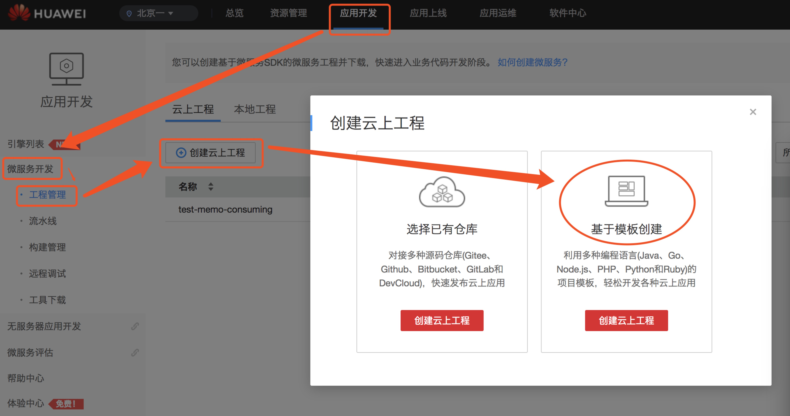
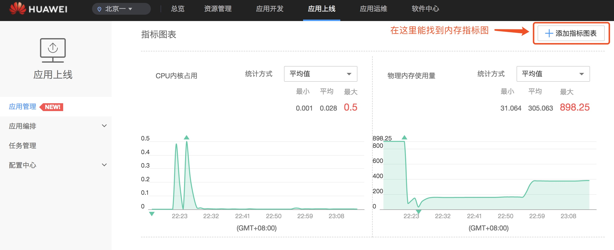

# Docker容器内部署Java微服务的内存限制问题

## 前言

前两天有同事发现，通过华为云 ServiceStage 的流水线部署基于模板创建的 CSEJavaSDK demo 服务时，会在容器启动过程中报错。初步排查是由于 JVM 占用的内存超出了 docker 内存配额的上限，导致容器被 kill 掉。于是我们需要排查一下问题出在哪里，为什么以前没有这类问题，而现在却发生了。

## 基本定位

要确定 docker 容器内存超限问题的直接原因并不难。直接进入docker容器，执行 `top` 命令，我们发现宿主机是一台8核16G的机器，而且 docker 并不会屏蔽这些信息，也就是 JVM 会认为自己工作于一台 16G 内存的机器上。而查看 demo 服务的 Dockerfile，发现运行服务时并没有对 JVM 的内存进行任何限制，于是 JVM 会根据默认的设置来工作 —— 最大堆内存为物理内存的1/4(这里的描述并不完全准确，因为 JVM 的默认堆内存大小限制比例其实是根据物理内存有所变化的，具体内容请自行搜索资料)，而基于模板创建的 ServiceStage 流水线，在部署应用堆栈的时候会把 docker 容器的内存配额默认设置为 512M，于是容器就会在启动的时候内存超限了。至于以前没有碰到过这种问题的原因，只是因为以前没将这么高规格的 ECS 服务器用于流水线部署应用堆栈。

在查询过相关资料后，我们找到了两种问题解决方案，一个是直接在 jar 包运行命令里加上 `-Xmx` 参数来指定最大堆内存，不过这种方式只能将 JVM 堆内存限制为一个固定的值；另一个方法是在执行 jar 包时加上 `-XX:+UnlockExperimentalVMOptions -XX:+UseCGroupMemoryLimitForHeap` 参数，让 JVM 能够感知到docker容器所设置的 `cgroup` 限制，相应地调整自身的堆内存大小，不过这个特性是 JDK 8u131 以上的版本才具备的。

最终，我们提醒 ServiceStage 流水线的同学将 CSEJavaSDK demo 的创建模板做了改进，在 Dockerfile 中将打包的基础镜像版本由原先的 `java:8u111-jre-alpine` 升级为了 `openjdk:8u181-jdk-alpine`，并且在运行服务 jar 包的命令中加上了 `-Xmx256m` 参数。问题至此已经解决了。

## 进一步的探究

虽然问题已经解决，但是在好奇心的驱使下，我还是打算自己找个 demo 实际去触发一下问题，另外看看从网上搜到的解决方法到底好不好用 : )

### 准备工作

1. 创建云上工程

  

  首先需要在华为云 ServiceStage 创建一个云上工程。

  在 ServiceStage -> 应用开发 -> 微服务开发 -> 工程管理 -> 创建云上工程中，选择“基于模板创建”，语言选择 Java， 框架选择 `CSE-Java (SpringMVC)`，部署系统选择“云容器引擎CCE”，给你的云上工程取一个名字，比如`test-memo-consuming`，最后选择存放代码的仓库，就可以完成云上工程的创建了。

  之后云上工程会根据你的选项自动地生成脚手架代码，上传到你指定的代码仓库中，并且为你创建一条流水线，完成代码编译、构建、打包、归档镜像包的操作，并且使用打好的 docker 镜像包在 CCE 集群中部署一个应用堆栈。

  > 创建云上工程和流水线不是本文的重点，我就不详细讲操作了 : )。同一个应用堆栈的实例可以部署多个，在这里为了实验方便就按照默认值1个来部署。

  
  由于云上工程已经改进了脚手架代码的模板，不会再出现内存超限的问题，所以我们现在能看到 demo 服务已经正常的跑起来，微服务实例已经注册到服务中心了。

  
  登录到 demo 服务所部署的容器，使用`curl`命令可以调用 demo 服务的 helloworld 接口，可以看到此时服务已经可以正常工作。

2. 增加实验代码

  为了能够触发微服务实例消耗更多的内存，我在项目代码中增加了如下接口，当调用`/allocateMemory`接口时，微服务实例会不停申请内存，直到 JVM 抛出 OOM 错误或者容器内存超限被 kill 掉。

  ```java
  private HashMap<String, long[]> cacheMap = new HashMap<>();

  @GetMapping(value = "/allocateMemory")
  public String allocateMemory() {
    LOGGER.info("allocateMemory() is called");
    try {
      for (long i = 0; true; ++i) {
        cacheMap.put("key" + i, new long[1024 * 1024]);
      }
    } catch (Throwable t) {
      LOGGER.info("allocateMemory() gets error", t);
    }
    return "allocated";
  }
  ```

  此时用来打镜像包的基础镜像是`openjdk:8u181-jdk-alpine`，jar 包启动命令中加上了`-Xmx256m`参数。

  执行流水线，应用堆栈部署成功后，调用`/allocateMemory`接口触发微服务实例消耗内存，直到 JVM 抛出 OOM 错误，可以在 ServiceStage -> 应用上线 -> 应用管理中选择相应的应用，点击进入概览页面，查看应用使用内存的情况。

  
  应用使用的内存从 800M+ 陡然下降的时间点就是我重新打包部署的时间，而之后由于调用`/allocateMemory`接口，内存占用量上升到了接近 400M，并且在这个水平稳定了下来，显示`-Xmx256m`参数发挥了预期的作用。

### 复现问题

现在将 demo 工程中的 Dockerfile 修改一下，将基础镜像改为 `java:8u111-jre-alpine`，并且删除启动命令中的`-Xmx256m`参数，将其提交为`noLimit_oldBase`分支，推送到代码仓库中。然后编辑流水线，将 source 阶段的任务所使用的代码分支改为`noLimit_oldBase`分支，保存并重新运行流水线，将新的代码打包部署到应用堆栈中。

<div align=center></div>
在微服务实例列表中查询到新的微服务实例的 endpoint IP 后，调用`/allocateMemory`接口，观察内存情况，内存从接近 400M 突然掉下去一下，然后又上升到约 450M 的时间点就是修改代码后的微服务实例部署成功的时间点，之后内存占用量突然下跌就是因为调用`/allocateMemory`接口导致容器内存超限被 kill 掉了。

如果你事先使用`docker logs -f`命令查看容器日志的话，那么日志大概是这个样子的
```
2018-11-23 15:40:04,920  INFO SCBEngine:152 - receive MicroserviceInstanceRegisterTask event, check instance Id...
2018-11-23 15:40:04,920  INFO SCBEngine:154 - instance registry succeeds for the first time, will send AFTER_REGISTRY event.
2018-11-23 15:40:04,925  WARN VertxTLSBuilder:116 - keyStore [server.p12] file not exist, please check!
2018-11-23 15:40:04,925  WARN VertxTLSBuilder:136 - trustStore [trust.jks] file not exist, please check!
2018-11-23 15:40:04,928  INFO DataFactory:62 - Monitor data sender started. Configured data providers is {com.huawei.paas.cse.tcc.upload.TransactionMonitorDataProvider,com.huawei.paas.monitor.HealthMonitorDataProvider,}
2018-11-23 15:40:04,929  INFO ServiceCenterTask:51 - read MicroserviceInstanceRegisterTask status is FINISHED
2018-11-23 15:40:04,939  INFO TestmemoconsumingApplication:57 - Started TestmemoconsumingApplication in 34.81 seconds (JVM running for 38.752)
2018-11-23 15:40:14,943  INFO AbstractServiceRegistry:258 - find instances[1] from service center success. service=default/CseMonitoring/latest, old revision=null, new revision=28475010.1
2018-11-23 15:40:14,943  INFO AbstractServiceRegistry:266 - service id=8b09a7085f4011e89f130255ac10470c, instance id=8b160d485f4011e89f130255ac10470c, endpoints=[rest://100.125.0.198:30109?sslEnabled=true]
2018-11-23 15:40:34,937  INFO ServiceCenterTaskMonitor:39 - sc task interval changed from -1 to 30
2018-11-23 15:47:03,823  INFO SPIServiceUtils:76 - Found SPI service javax.ws.rs.core.Response$StatusType, count=0.
2018-11-23 15:47:04,657  INFO TestmemoconsumingImpl:39 - allocateMemory() is called
Killed
```
可以看到`allocateMemory`方法被调用，然后 JVM 还没来得及抛出 OOM 错误，整个容器就被 kill 掉了。

> 这里也给大家提了一个醒：**不要以为自己的服务容器能启动起来就万事大吉了**，如果没有特定的限制，JVM 会在运行时继续申请堆内存，也有可能造成内存用量超过 docker 容器的配额！

### 让 JVM 感知`cgroup`限制

前文提到还有另外一种方法解决 JVM 内存超限的问题，这种方法可以让 JVM 自动感知 docker 容器的 `cgroup` 限制，从而动态的调整堆内存大小，感觉挺不错的。我们也来试一下这种方法，看看效果如何 ; )

回到demo项目代码的`master`分支，将 Dockerfile 中启动命令参数的`-Xmx256m`替换为`-XX:+UnlockExperimentalVMOptions -XX:+UseCGroupMemoryLimitForHeap`，提交为`useCGroupMemoryLimitForHeap`分支，推送到代码仓库里。再次运行流水线进行构建部署。

<div align=center></div>
等 demo 服务部署成功后，再次调用`/allocateMemory`接口，容器的内存占用情况如上图所示（最右边的那一部分连续曲线），内存上升到一定程度后，JVM 抛出了 OOM 错误，没有继续申请堆内存。看来这种方式也是有效果的。

不过，仔细观察容器的内存占用情况，可以发现容器所使用的内存仅为不到 300M，而我们对于这个容器的内存配额限制为 512M，也就是还有 200M+ 是闲置的，并不会被 JVM 利用。这个利用率，比起上文中直接设置`-Xmx256m`的内存利用率要低 : ( 。推测是因为 JVM 并不会感知到自己是部署在一个 docker 容器里的，所以它把当前的环境当成一个物理内存只有 512M 的物理机，按照比例来限制自己的最大堆内存，另一部分就被闲置了。

> 如此看来，如果想要充分利用自己的服务器资源，还是得多花一点功夫，手动调整好`-Xmx`参数。

## 参考资料

- [Java and Docker, the limitations](https://royvanrijn.com/blog/2018/05/java-and-docker-memory-limits/ "Java and Docker, the limitations")
- [Java inside docker: What you must know to not FAIL](https://developers.redhat.com/blog/2017/03/14/java-inside-docker/ "Java inside docker: What you must know to not FAIL - RHD Blog")
